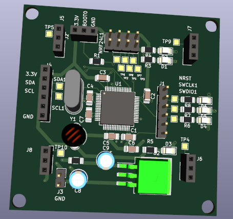
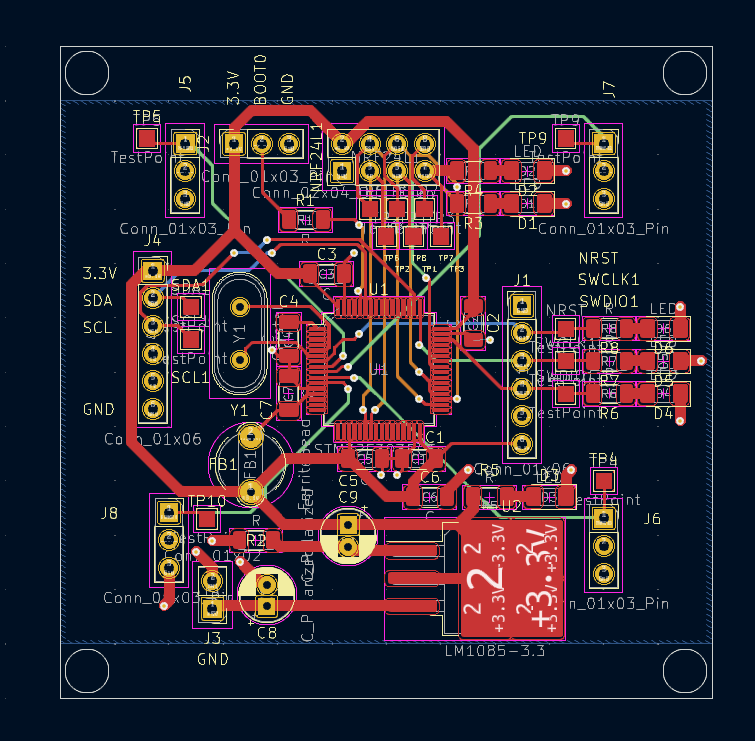

# STM32_FCU
### An stm32-based Flight Controller Unit
This is a voluntary ITEK summer project at OAMK, which is an independent summer project for students at Oulu University of Applied Sciences.

## Contents
 - 0.0 - What is a FCU?
 - 1.0 - Project goals
 - 2.0 - Components used
 - 3.0 - Software & flowchart
   
## 0.0 - What is a FCU?
A flight controller unit, an abbreviation for FCU, works as a general manager for a drone.
It's purpose is to handle communication between a drone's different components. The most basic FCU handles the task of transferring the commands it receives from a user radio to 4 PWM signals to be delivered to the Electronic Speed Controller. 

## 1.0 Project goals
The goal of this project is to design a flight controller that is able to receive commands from a radio, and turn them into useful signals for a commercial ESC. The drone also needs to be able to fly in a stable manner, meaning some sort of positional correction is to be needed.

## 2.0 - Main Components used
Here are the components chosen for this project:
- STM32F303RBT6 (Microcontroller). You can also use the STM32F303RCT6 with hardware generated PWM for ease of use.
- MMA8452Q Three-axis accelerometer for positional correction in mid-air(unimplemented as of yet.)
- NRF24L01 Radio transceiver for data transmission and receiving.

## 3.0 Software & flowchart
To make this project work, you need both the NRF24L01 Library as well as the MMA8452 library. The MMA library is included as a part of this project, and you can get the NRF library from here: 
https://github.com/controllerstech/NRF24L01
Remember to customize the NRF library according to the device you are using. The original library was written for the F4-series, and we use the F3 in this project.

Here is the flowchart for this controller: 

The packet that the controller receives should consist of the following bytes:

| Byte 0  | Byte 1 | Byte 1 | Byte 1 | Byte 1 | Byte 1 | Byte 1 | Byte 1 | Byte 1 | Byte 1 | Byte 1 | Byte 1 | Byte 1 | 
| ------------- | ------------- |
| Content Cell  | Content Cell  |
| Content Cell  | Content Cell  |

## 5.0 Pcb Design Layout

